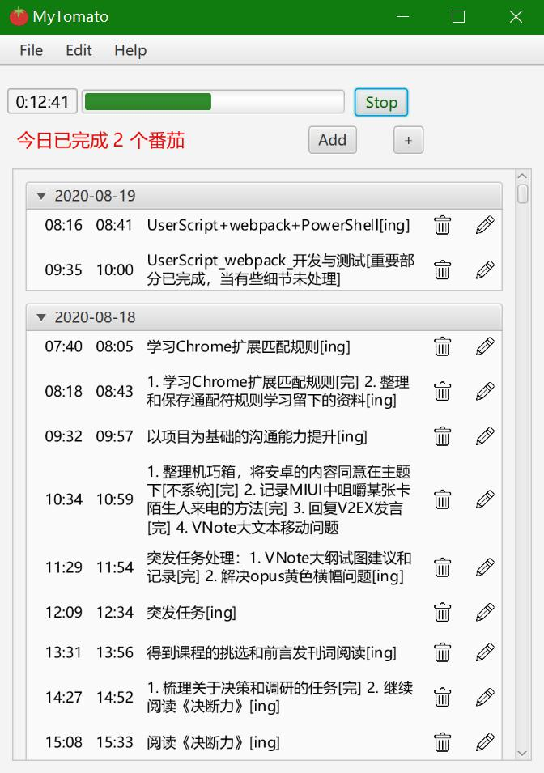

# [MyTomato简介](https://github.com/Andy-AO/MyTomato)

用JavaFX写的跨平台个人番茄工作法工具，[开源免费](https://github.com/Andy-AO/MyTomato)，轻量而纯粹，没有任何多余的功能。

已经作为主力番茄工作法工具使用接近1年，现有的方案基本上都是Electron，会占用大量资源，而且很多都收费。

看到 V2EX 上的那个帖子，所以准备贡献出来，给和我一样不太喜欢 Electron 的人用。

本来是自用的，能用就行，所以很长时间没改进了，后期可能会继续改进。

[我的软件“wnr”上架了 Product Hunt！ - V2EX](https://www.v2ex.com/t/698913#reply22)

# 下载

[Releases · Andy-AO/MyTomato](https://github.com/Andy-AO/MyTomato/releases)

解压后运行`MyTomato.jar`，需要Java8及以上环境。

理论上跨平台，但并未实际测试。